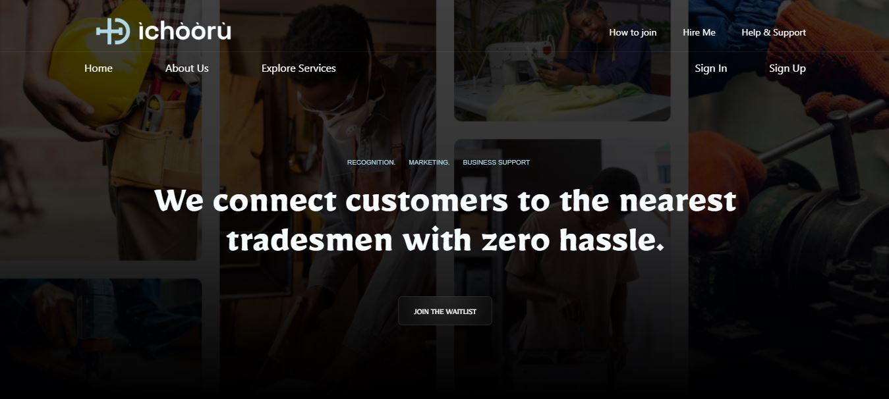

# 👨‍💻 My Portfolio

Welcome to my personal portfolio website! This is a modern and responsive site that showcases my skills, projects, and background as a developer.

---

## 🚀 Features

- 🎨 Clean and responsive design
- 📄 About Me section
- 🛠️ Skills overview
- 📁 Portfolio/projects with links and descriptions
- ✉️ Contact form or contact details
- 🌙 Optional dark mode toggle

---

## 🛠 Built With

- HTML5 & CSS3
- JavaScript (or TypeScript)
- React / Vue / Vanilla JS *(depending on your stack)*
- (Optional) Tailwind CSS / Bootstrap
- (Optional) EmailJS / Formspree for contact forms

---

## 📦 Getting Started

### 1. Clone the Repo
```bash
git clone https://github.com/your-username/your-portfolio.git
cd your-portfolio
```

### 3. Start Development Server

```bash
npm start
```

---

## 📸 Preview


*A clean, minimal portfolio homepage*

---

## 🔗 Live Demo

🌐 [View Live](https://my-portfolio-psi-taupe-97.vercel.app)

---

## ✍️ Customization Tips

* Update your personal info in `/src/data` or directly in the HTML.
* Replace placeholder projects with your own.
* Update styles in `styles.css` or use a custom theme.

---

## 📄 License

This project is licensed under the MIT License.
Feel free to use it as a template for your own portfolio!

---

## 🙌 Acknowledgments

Inspired by portfolio designs from the developer community.

```

---
